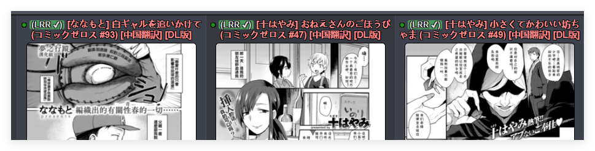

# LANraragi-scripts
自用LANraragi相关脚本

## e站浏览标识器
- 脚本功能：在e站的搜索浏览页面上添加标识，标识出该画廊是否在LANraragi中存在
- 安装方法：将`ExHentai Lanraragi Checker.js`放入浏览器的用户脚本管理器中，配置`lanraragi的地址`和`API key`后启用该脚本
- 使用效果：
 其中绿色标记`LRR ✔`为存在且使用该画廊的元数据刮削，紫色标记`LRR！`为使用标题检索在LANraragi中存在，刮削源可能为同名的其他画廊。

## 版权作者标记
- 脚本功能：在LANraragi中标记版权作者的所有画廊，由于没有确切的版权本数据来源，因此脚本会将存在版权作者的所有画廊均打上`其他:版权本`标记
- 使用前提：LANraragi的画廊元数据中包含`艺术家:xx`或`群组:xx`的标签
- 使用方法：将`ApplyCopyrightTags.py`和`search_keywords.txt`下载到同一位置，配置`lanraragi的地址`和`管理员密码`后使用`python ApplyCopyrightTags.py`启动。我个人测试约花费了10分钟左右的时间。

## hdoujin元数据刮削插件（*不要开启自动运行，仅作为补漏使用）
- 脚本功能：从[hdoujin.org](https://hdoujin.org)中获取画廊的元数据
- 使用方法：将`hdoujin.pm`下载后，在LANraragi的插件配置页面上传，并配置好参数即可。插件需要的UUID可以在站点注册后，在搜索页面用f12抓取，在标头的`Authorization`字段里，样子一般为`Bearer adaddddd4-811e-4c09-8457-1dddddddae12`，只需要将后半那一长串填入插件配置即可。
- 一些说明：目前[hdoujin.org](https://hdoujin.org)的搜索规则不太完善，使用[作者名 画廊名]检索时会没有返回数据。
  因此，在没有填写对应画廊链接的情况下，仅会使用画廊的标题检索，并不会附带作者名。虽然大多数情况下匹配应该是没问题的，但可能也会错误匹配到其他同名画廊。
  个人建议仅在hentag和ehentai等插件刮削不到元数据时再使用这个插件尝试补充元数据。

## 其他github上我觉得有用的lanraragi周边内容
 - **地址:** [ETagCN](https://github.com/zhy201810576/ETagCN/releases)
   **描述:** 汉化版的ehentai刮削插件，可直接刮削汉化tag

 - **地址:** [ETagConverter](https://github.com/zhy201810576/ETagConverter/releases)
   **描述:** 用于将插件刮削的英文tag转换为中文的脚本

 - **地址:** [addEhentaiMetadata](https://github.com/chu-shen/LANraragi/blob/feat-ratingAndcomment/lib/LANraragi/Plugin/Scripts/addEhentaiMetadata.pm)
   **描述:** 可以为所有没有`source标签`的本子触发一次`ehentai`插件刮削，这样可以进行查缺补漏。

 - **地址:** [chu-shen/LANraragi-scripts](https://github.com/chu-shen/LANraragi-scripts)
   **描述:** 一些插件集合

 - **地址:** [chihiro830/LANraragiPlugin](https://github.com/chihiro830/LANraragiPlugin)
   **描述:** `FolderToCat` 插件的增强版本。该插件可以将内容文件夹中的子文件夹自动转换为静态分类

 - **地址:** [starP-W/HAtH-Plugin-CN](https://github.com/starP-W/HAtH-Plugin-CN)
   **描述:** 通过 `HentaiAtHome Downloader` 的 `galleryinfo.txt` 文件收集嵌入存档的元数据

 - **地址:** [Tsukihi](https://github.com/Difegue/Tsukihi)
   **描述:** 用于在e-hentai检索当前画廊是否已经在LRR中的浏览器插件。
