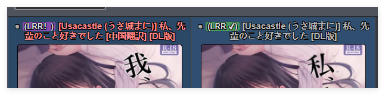

# LANraragi-scripts
自用LANraragi相关脚本

## e站浏览标识器
- 脚本功能：在e站的搜索浏览页面上添加标识，标识出该画廊是否在LANraragi中存在
- 安装方法：将`ExHentai Lanraragi Checker.js`放入浏览器的用户脚本管理器中，配置`lanraragi的地址`和`API key`后启用该脚本
- 使用效果：
 其中绿色标记`LRR ✔`为存在且使用该画廊的元数据刮削，紫色标记`LRR！`为使用标题检索在LANraragi中存在，刮削源可能为同名的其他画廊。

## 版权作者标记
- 脚本功能：在LANraragi中标记版权作者的所有画廊，由于没有确切的版权本数据来源，因此脚本会将存在版权作者的所有画廊均打上`其他:版权本`标记
- 使用前提：LANraragi的画廊元数据中包含`艺术家:xx`或`群组:xx`的标签
- 使用方法：将`ApplyCopyrightTags.py`和`search_keywords.txt`下载到同一位置，配置`lanraragi的地址`和`管理员密码`后使用`python ApplyCopyrightTags.py`启动。我个人测试约花费了10分钟左右的时间。

## hdoujin元数据刮削插件（*不要开启自动运行，仅作为补漏使用）
- 脚本功能：从[hdoujin.org](https://hdoujin.org)中获取画廊的元数据
- 使用方法：将`hdoujin.pm`下载后，在LANraragi的插件配置页面上传，并配置好参数即可。插件需要的UUID可以在站点注册后，在搜索页面用f12抓取，在标头的`Authorization`字段里，样子一般为`Bearer adaddddd4-811e-4c09-8457-1dddddddae12`，只需要将后半那一长串填入插件配置即可。
- 一些说明：目前[hdoujin.org](https://hdoujin.org)的搜索规则不太完善，使用[作者名 画廊名]检索时会没有返回数据。
  因此，在没有填写对应画廊链接的情况下，仅会使用画廊的标题检索，并不会附带作者名。虽然大多数情况下匹配应该是没问题的，但可能也会错误匹配到其他同名画廊。
  个人建议仅在hentag和ehentai等插件刮削不到元数据时再使用这个插件尝试补充元数据。